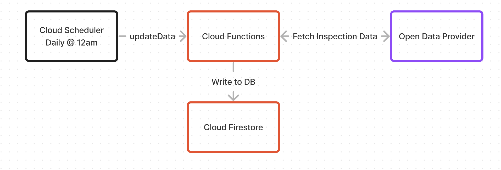

# DineSmart Update Service
## Overview
The DineSmart Update Service is responsible for updating the DineSmart database with the latest restaurant health
inspection data.

### Supported Data Providers
Currently, this project supports the following data providers:
- City of Toronto

## Technologies
- Cloud Functions for Firebase
- Cloud Firestore
- Node.js
- TypeScript

## Architecture

## Related Projects
- [dinesmart](https://github.com/maldahleh/dinesmart): iOS Client
- [dinesmart-retrieval-service](https://github.com/maldahleh/dinesmart-retrieval-service): Express API that exposes the contents of the Cloud Firestore database
